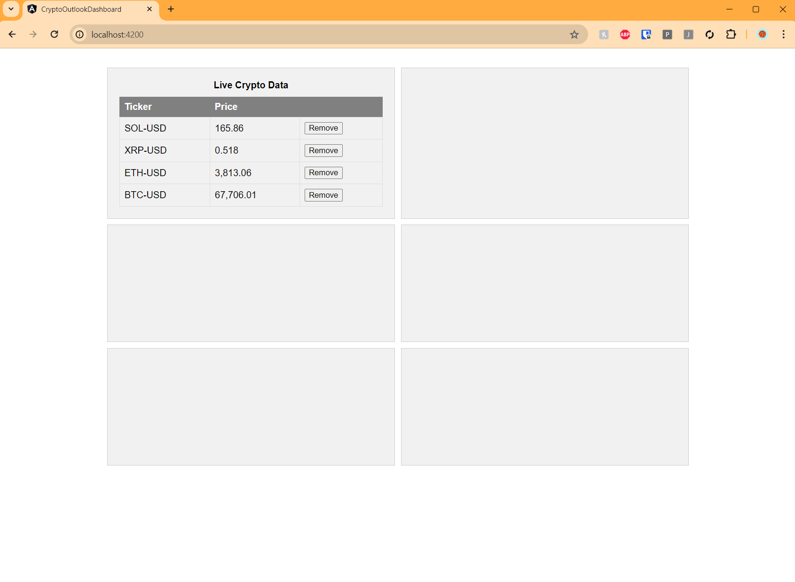
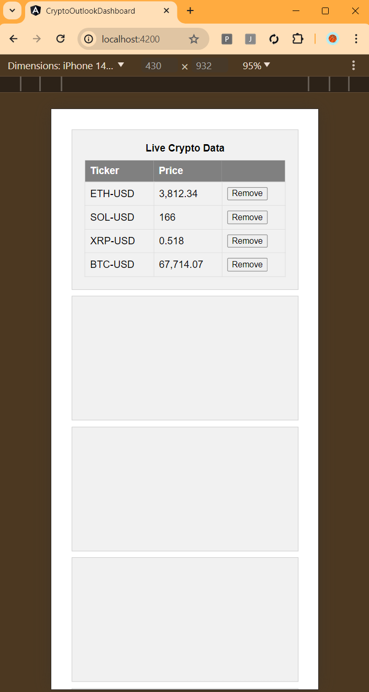
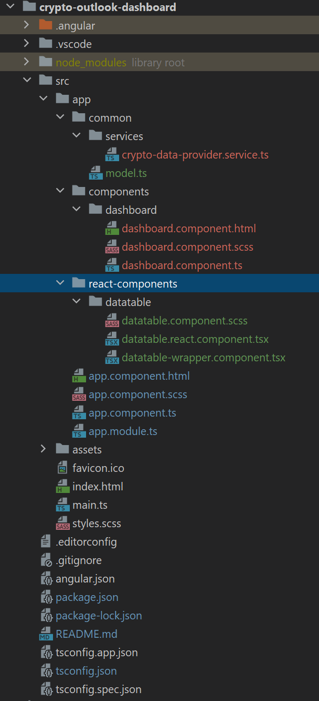

# Crypto Outlook

## Description
The dashboard page shows various widgets showing prices of various Crypto Currencies, with other useful data for trading. User can remove unwanted items from the list to narrow down the items.

### Desktop View

### Mobile View

## Features

### Dashboard
The Dashboard shows 2 columns of various sections, each containing different widgets showing crypto currency informaiton in different and useful way.
The design is responsive, meaning, using then on mobile view, automatically scales back the webpage turning it into single column look.

### Live Crypto Prices Widget
First section in the first row, shows a widget displaying various crypto-currencies, allowing user to remove individual items from the existing list if not wanted.

## Project Architecture
Overall project is created in Angular 15.

### Screenshot

### Dashboard - Angular
The Dashboard is the main angular component. It contains, 3 rows and 2 columns of flex design, every box could contain single widget/component. 
The design is responsive so in mobile view, it shows single column. 

### Datatable Component - React
One of the components in react-component directory, is datatable. The datatable.react.component.tsx contains a react component displaying crypto prices in table format.
Also, it allows user to remove the record from the table. The user click is emitted further to the host components passing selected ticker data.

### Wrapper Component for React component Datatable
There is a wrapper component (datatable-wrapper.component) for the above react component allowing cleaner interface for other components.

Here the dashboard component acts as a host component, embedding above wrapper component passing the data over parameters, and handing user's remove action further.

### Crypto data provider service
In common/services, there is crypto-data-provider service. This service allows components to subscribe on live coinbase API to fetch the live crypto prices.

In our case, the dashboard subscribes to the live data using above service sending predefined sets of tickers.

## Data Workflow

### Loading Crypto Prices

1. First, Dashboard loads and establishes a websocket connection using crypto-data-provider service passing list of tickers
2. Dashboard filters above data, makes a single list with updated ticker prices, and passes to the datatable-wrapper component
3. datatable-wrapper component passes the same data to react based datatable component
4. react datatable, shows data in table format

### Removing Crypto Items
1. Clicking on remove button in react datatable, emits event passing ticker value, which is handled by the wrapper datatable component
2. The wrapper component then emits another event which is handled by the host dashboard page
3. The dashboard page removes item from tickers list,and data list and re-establishes connection using data provider service with new tickers list

## Installation and Running guide

### Installation
1. Go to the directory of the project using command promt
2. Run npm install

### Running the project
1. Install angular cli globally
> npm install -g @angular/cli
2. Run the project using this command
> ng serve
